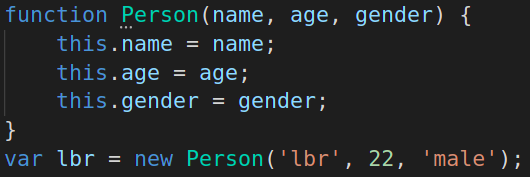

# 面向对象

## 1. 创建方法

> 1. 字面量
>
> 2. new Object
>
> 3. 构造函数

### （1）字面量创建对象

### （2）new-object创建对象

### （3）构造函数创建对象

## 2. 调用方法

> 1. 对象名.属性名
> 2. 对象名['属性名']
> 3. 对象名.方法名()

## 3. 遍历对象

> 使用for...in...进行对象的遍历

