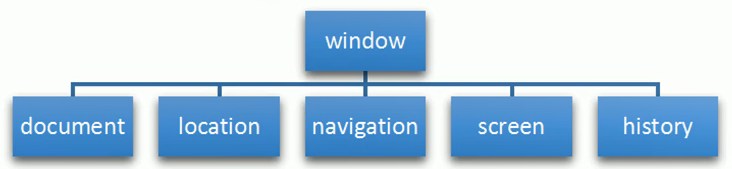

# BOM

## 1. BOM概述

BOM是浏览器对象

BOM的顶级对象是window

## 2. BOM结构



## window对象常见的事件

### （1）窗口加载事件

```javascript
window.onload = function(){}
// 或者
window.addEventListener("load", function(){})
```

当文档内容完全加载完成后触发该事件

也可以使用“DOMContentLoaded”，等待dom加载完毕

### （2）窗口大小调整事件

```javascript
window.addEventListener("resize", function(){})
```

只要窗口大小发生变化，触发函数

使用`window.innerWidth`可以获取到当前屏幕宽度

用`window.innerHeight`可以获取当前屏幕高度

### （3）定时器setTimeout

```javascript
window.setTimeout(调用函数, 延时时间);
```

为了区分，可以给定时器加标识符，如：

```javascript
var time1 = setTimeout(callback, 3000);
// window可省略
```

定时器也可以清除

```javascript
window.clearTimeout(定时器ID);
```

### （4）定时器setInterval

重复调用一个函数，每隔一个时间段，就重复调用一次

```javascript
window.setInterval(回调函数, [间隔毫秒数]);
```
